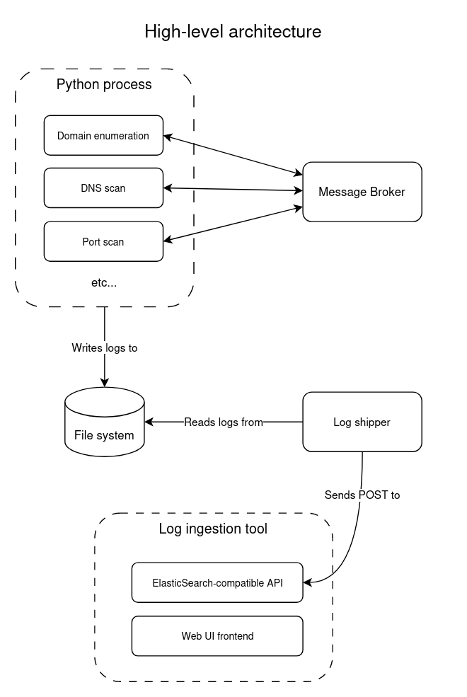

# Recon Pipeline

> This project is currently a work in progress in its early development stages.

A distributed and containerized reconnaissance pipeline.

All reconnaissance steps run asynchronously and communicate through a message broker.

The logs generated by each step are forwarded to a log ingestion backend, allowing for easy querying and analysis in a web interface.

